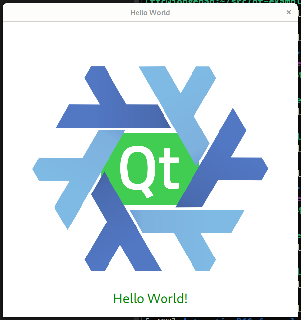

# Qt Example App

This repository contains a minimal QtQuick QML example that looks like this:



The purpose of this repository is to show how to edit, build, and package this
application without installing Qt on your system stationary.

To build or run the app, some prerequisites are needed: Qt, CMake, etc.
These can be installed with one step using the package manager **nix**, which
you get here: https://nixos.org/download.html

Once nix is installed, you can run this application without cloning this repository using:

```sh
nix run github:tfc/qt-example
```

This might take a minute because nix first needs to get Qt, compiler, etc. from 
the internet.

## Building the app locally

After you have checked out and `cd`ed into the repository, there are multiple
ways to build the app:

```sh
# Just build the app
nix build
```

now you can execute it via:

```sh
./result/bin/qt-example
```

If you want to edit, build, and run it from the Qt Creator development environment, you can run that, too:

```sh
nix develop
qtcreator
```

The first command installs Qt Creator and other dependencies in your local
shell (which is not system-wide).
If you want to get rid of it, run `exit` and that is it.

As Qt Creator and Qt are typically installed system-wide and hence form some 
assumptions of your system, things might sometimes go wrong.
I know of the following situations and solutions:

- Qt Creator does not find Qt libraries:
  - delete all `~/.config/QtProject*` paths, as these could set some wrong assumptions from older versions that you might have installed before
- Building the app does not work, I get compiler errors
  - In the Qt Creator options dialog, visit "kits" and check the inputs of the 
    C and C++ compiler dropdown lists. 
    The nix shell gives you two compilers there, one with and one without
    "wrapped" in the path. Select the "wrapped" one.
  - Sometimes the qt kit selection is wrong and Qt Creator displays it as
    "invalid". Recheck the valid one that is left in the dropdown.

